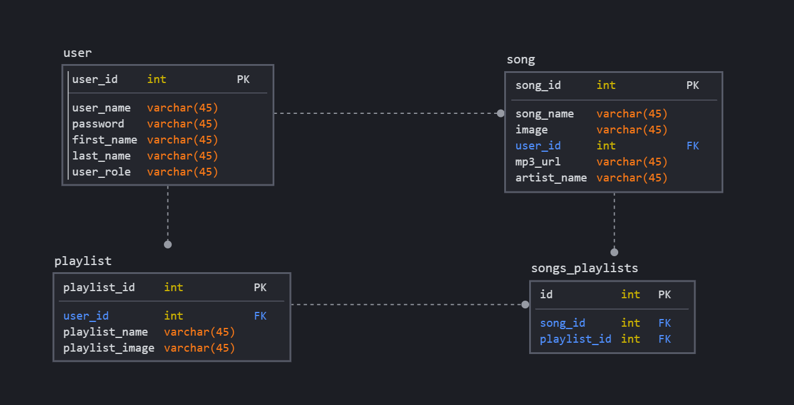

# Melodies App Back End
# Melodies App

<!-- PROJECT LOGO -->
 

  

  <h3 align="center">Melodies App</h3>

  

    A Music App Allows Users To Listen, Explore And Search For Their Music !
     
    <a href="https://pages.git.generalassemb.ly/xloli20/MelodiesAppFrontEnd/"><strong>Go to the app »</strong></a>
     
     
    <a href="https://git.generalassemb.ly/xloli20/MelodiesAppBackEnd">Melodies App Back End</a>
    ·
    <a href="http://melodieswebapp-env.eba-kgzwebax.us-east-2.elasticbeanstalk.com/">API URL</a>
  

## Relational Database Design(ERD)

## Routes

|Method        | Route Path            | Request Body       | Request Parameter |
|:--         | :--             | :--         | :-- |
|GET | /user/index | none | none 
|GET | /user/profile | none | email 
|POST  | /user/registration | user | none
|POST | /user/login | user | none
|PUT | /user/edit | user | email
|PUT | /user/changePassword | user | currentPassword
|DELETE | /user/delete | none | id
|GET | /song/index | none | none 
|POST  | /song/add | song | none
|PUT | /song/edit | song | none
|DELETE | /song/delete | none | id
|GET | /playlist/index | none | none
|GET | /playlist/detail | none | id 
|POST  | /playlist/add | playlist | none
|PUT | /playlist/edit | playlist | none
|DELETE | /playlist/delete | none | id
